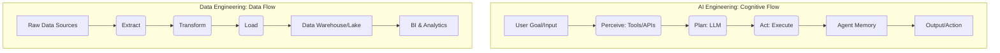

The technology industry is captivated by the potential of AI agents—autonomous systems capable of reasoning, planning, and executing complex tasks. As companies rush to hire "AI Engineers" to develop the next generation of applications, they may be overlooking a critical resource already within their organizations: their data engineering teams. 

The challenge with the current AI hype is that a compelling demo in a development environment is significantly different from a reliable, scalable, and cost-effective AI agent in production. This gap between prototype and product is not an AI-specific problem; it is a systems engineering problem. It is also a problem that data engineers have been successfully addressing for the past decade. 

The evolution of AI applications mirrors the Big Data revolution. The fundamental challenges—managing complex workflows, handling massive state, ensuring data quality, and building scalable infrastructure—are the same. The primary difference is the nature of the payload; instead of merely moving data, we are now orchestrating cognitive processes. 

### **From Data Flows to Cognitive Flows: A Familiar Blueprint** 

Data engineers have extensive experience in building and managing intricate data pipelines. They transform raw, chaotic data from various sources into reliable, queryable sources of truth through a series of extraction, transformation, and loading (ETL) processes. 

An AI agent's "Sense-Plan-Act" loop is essentially a new type of ETL pipeline. It takes a user's goal, assesses its environment through tools and APIs, develops a course of action using a large language model (LLM), and then acts on that plan. This process can be viewed as a "cognitive flow," and the engineering principles are identical to those of data flows. 

For data engineering teams, this represents a domain upgrade rather than a career change. Their core skills are directly applicable to the AI agent stack: 

#### ETL/ELT Pipelines → Agentic Workflow Orchestration

Data engineers' expertise in managing complex data dependencies with tools like Apache Airflow and Prefect is directly transferable to orchestrating agentic workflows. Instead of managing failed SQL queries, the new challenge will be handling failed API tool calls or malformed LLM responses. 

#### Data Warehousing & Data Lakes → The Agent's Memory System

The skills used to design schemas for data warehouses like Snowflake or BigQuery are essential for building an agent's multi-layered memory architecture. This includes managing episodic, semantic, and working memory using technologies like PostgreSQL, vector databases, and Redis. 

#### Data Quality & Governance → AI Evaluation & MLOps

The practice of ensuring data quality with tools like Great Expectations is analogous to building an automated AI evaluation pipeline. Instead of checking for null values, data engineers will be checking for hallucinations, bias, or relevance using tools like LangSmith or Ragas. 

#### Infrastructure Management → AI Service Deployment

The use of Docker, Kubernetes, and Terraform to deploy and scale distributed systems is the same skillset required to deploy the new AI stack. The principles of containerization, auto-scaling, and infrastructure-as-code are foundational to both. 

Here is a table to compare the toolsets between the two roles.

| Core Engineering Task | Data Engineering Tools/Concepts | AI Agent Engineering Tools/Concepts |
| :--- | :--- | :--- |
| **Workflow Orchestration** | Apache Airflow, Prefect, dbt | LangGraph, Temporal, AWS Step Functions |
| **Data Storage & Modeling** | Snowflake, BigQuery, Data Lakes | Vector Databases, PostgreSQL, Redis |
| **Quality Assurance** | Great Expectations, dbt tests | LangSmith, Ragas, AI Evaluation Pipelines |
| **Infrastructure & Deployment** | Kubernetes, Terraform, Docker | vLLM, Kubernetes, GPU Management |

### **A Strategic Imperative for Leaders** 

For CTOs and engineering leaders, the message is clear: avoid creating new silos. The path to production-grade AI lies with your data engineering team. They possess the systems-thinking approach necessary to move beyond demos. By equipping them with new AI-specific tools, you can leverage their years of experience in building scalable and reliable systems. 

The competitive advantage in the age of AI will not be determined by access to a specific large language model, but by the robustness, efficiency, and sophistication of the system built around it. This is an engineering challenge that data engineers are uniquely equipped to solve. 

### **A Call to Action for Data Engineers** 

Your skills are more valuable than ever. The industry requires professionals who think in terms of systems, reliability, and scale. Embrace new tools like LangGraph, experiment with vector databases, and understand the capabilities of durable execution engines like Temporal. 

You are no longer just moving data; you are building the assembly lines for automated thought and decision-making. This is the most significant engineering challenge of our time, and you are already positioned to lead the way.
