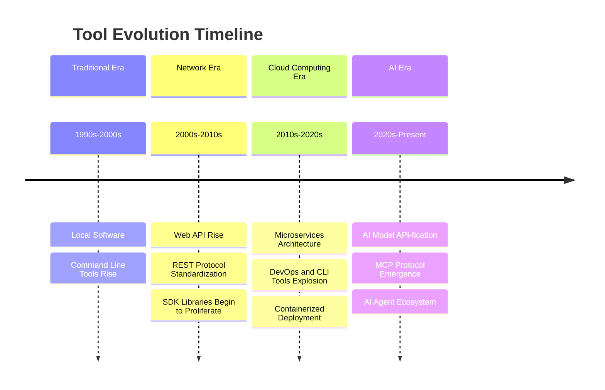
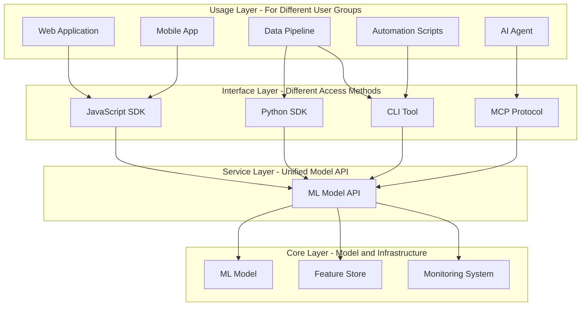
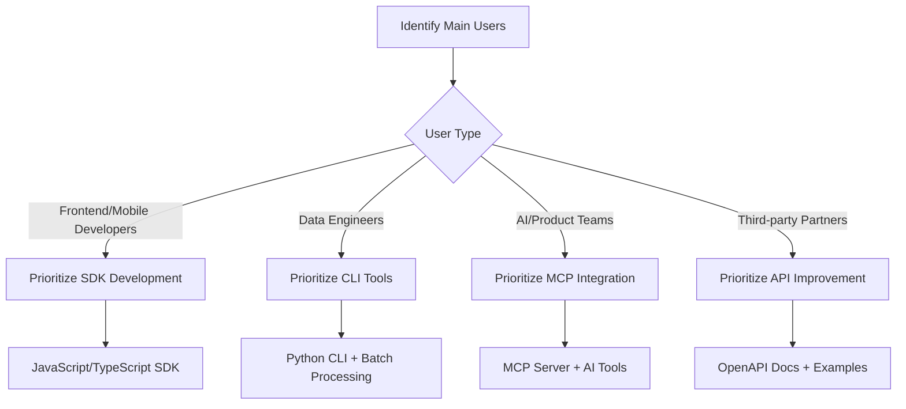

Do you remember that moment when I first tried to deploy a prediction model to production at AstrumU?

It was a moment that filled me with excitement: after months of data exploration, feature engineering, and model tuning, I had finally trained a prediction model with an AUC of 0.88. **As a data scientist, nothing is more thrilling than seeing your model about to be used in the real world.**

The product team's request sounded straightforward: integrate this model into the ReadySet application to provide intelligent decision support for the business team. I was already imagining it: business managers opening the dashboard, seeing clear prediction scores, making smart decisions based on my algorithm, truly enhancing business results. **This was my original intention as a data scientist—letting data and algorithms create real business value.**

I confidently said: "No problem, the model accuracy is high, give me a week."

A week later, I delivered... an [AzureML endpoint](https://docs.microsoft.com/en-us/azure/machine-learning/).

"How do we call this?" asked Sarah from frontend.
"You use this [REST API](https://restfulapi.net/), then pass in the feature data," I replied.
"What about authentication? How do we manage this [Bearer token](https://tools.ietf.org/html/rfc6750)? What if Azure's endpoint goes down?" pressed Mike from DevOps.
"Uh... it should be explained in the Azure documentation?" I answered sheepishly.

**At that moment, I felt the deepest frustration as a data scientist**: not because the model wasn't good enough, not because there were data problems, but because my carefully crafted algorithm couldn't actually be used. It was like cooking a delicious dish only to discover there were no proper utensils for guests to enjoy it.

It became clear that building an excellent ML model is just the first step of a long journey. The real challenge is: **How do you make your model elegantly integrate into existing technology ecosystems and truly create value?**

Today, I want to talk about the four most critical tools in this process: [API](https://en.wikipedia.org/wiki/API), [SDK](https://en.wikipedia.org/wiki/Software_development_kit), [CLI](https://en.wikipedia.org/wiki/Command-line_interface), and [MCP](https://github.com/modelcontextprotocol). Not because they're cool, but because without understanding them, your model will forever remain trapped in [Jupyter Notebook](https://jupyter.org/).

## The Truth It Took Me Three Years to Understand: The Deep Logic Behind Four Tools

In retrospect, my confusion was actually quite normal. **As data scientists, our thinking pattern is "data in, insights out," but production environment challenges are completely different.**

After years of practice, I discovered that API, SDK, CLI, and MCP—these four tools actually correspond to the four chasms our models must cross to go from laboratory to real world.

**From a historical perspective, the emergence of these four tools also reflects the evolution trajectory of the entire software industry:**



Understanding this evolution process helped me realize: **We're not reinventing the wheel, but following the natural evolution of the industry.** Each era's technological development has provided new possibilities for ML model deployment.

### The First Chasm: From Notebook to Service (API Value)

Remember that moment when I first realized this problem? I stared at that simple line of code in [Jupyter Notebook](https://jupyter.org/):

```python
prediction = model.predict(X_test)
```

Then looked at my frontend colleague's confused expression and suddenly understood: **In my world, prediction is this simple. But in their world, this needs to be a system that's always available, never crashes, and can serve hundreds or thousands of users simultaneously.**

This is the first chasm API solves: **How do you turn that simple line of code in your Notebook into a stable service that the entire software ecosystem can depend on?**

When I truly understood this, I began to re-examine production environment requirements:
- Your model needs to be **stateless**—each prediction is independent
- It needs **concurrent processing**—serving multiple user requests simultaneously
- It needs **graceful degradation**—partial failures can't affect the entire system
- It needs **resource management**—reasonable use of memory and GPU

**The essence of API is wrapping your `model.predict()` into a first-class citizen of modern software architecture.**

### The Second Chasm: From Technical to Business (SDK Value)

After having an API, I thought everything was fine. Until Sarah from frontend struggled with my API documentation for an entire afternoon, I discovered **the second chasm: technical feasibility doesn't equal business usability.**

Sarah's frustration got me thinking: **Why does a perfectly functional API cause such pain for business teams?**

The answer is simple: every team has its own "technical dialect." Frontend teams are used to [JavaScript](https://developer.mozilla.org/en-US/docs/Web/JavaScript) [promises](https://developer.mozilla.org/en-US/docs/Web/JavaScript/Reference/Global_Objects/Promise), data teams are familiar with [Python](https://www.python.org/) [DataFrames](https://pandas.pydata.org/docs/reference/api/pandas.DataFrame.html), mobile teams prefer [Swift](https://developer.apple.com/swift/)'s strong type system. **Forcing them all to learn [HTTP calls](https://developer.mozilla.org/en-US/docs/Web/HTTP), error handling, and authentication mechanisms is like asking an English native speaker to directly read Chinese classical poetry.**

Look at what frontend teams need to write without SDK:
```javascript
// This is the complexity frontend colleagues need to handle
fetch('/api/predict', {
  method: 'POST',
  headers: {
    'Content-Type': 'application/json',
    'Authorization': `Bearer ${token}`,
    'X-API-Version': '2.0'
  },
  body: JSON.stringify({
    features: inputData,
    model_version: 'latest'
  })
}).then(response => {
  if (!response.ok) {
    // Complex error handling logic
  }
  return response.json();
}).catch(error => {
  // Network error handling
});
```

With SDK, the same functionality becomes:
```javascript
// Clean call using SDK
import { PredictionClient } from 'company-ml-sdk';
const client = new PredictionClient(apiKey);
const result = await client.predict(inputData);
```

**SDK's value lies in translation: it translates your model capabilities into each team's familiar "technical dialect."**

### The Third Chasm: From Single-use to Scale (CLI Value)

After solving the first two problems, I thought I could peacefully watch the model run in production. But soon, Tom from our data engineering team brought a new challenge: "I need to batch process 50,000 historical records, but your API can only process one at a time. At this rate, it'll take all day..."

**This revealed the third chasm: the huge gap between individual services and scaled operations.**

As data scientists, we easily fall into the "one prediction at a time" mindset. But in real business environments, we often face:
- **Historical data backfill**: Need batch predictions on hundreds of thousands of historical records
- **Scheduled tasks**: Automatically process new data batches every morning
- **[A/B testing](https://en.wikipedia.org/wiki/A/B_testing)**: Run multiple model versions simultaneously for comparison
- **Model evaluation**: Evaluate different versions' performance on multiple datasets

In these scenarios, manually calling APIs or writing temporary scripts isn't a long-term solution. **We need industrial-grade automation tools.**

This is where CLI's value lies. Look how these scenarios are elegantly solved:

```bash
# Batch model evaluation, one command done
ml-model evaluate --model prediction_v2 \
  --datasets validation,test,production_sample \
  --metrics auc,precision,recall \
  --output evaluation_report.json

# Data pipeline integration, perfect fit for Airflow tasks
ml-model batch-predict \
  --input s3://data/new_data.csv \
  --output s3://predictions/results.csv \
  --model-version latest \
  --batch-size 1000

# A/B test deployment, automatic monitoring and rollback
ml-model deploy --model prediction_v2 \
  --environment staging \
  --traffic-split 10% \
  --rollback-threshold 0.05
```

**CLI's unique value is being the bridge between data science and DevOps.** It not only seamlessly integrates into modern operations toolchains, but more interestingly, CLI is also the most natural way for AI programming assistants like [Claude Code](https://docs.anthropic.com/en/docs/claude-code) to understand and use—AI can directly "understand" command-line operations just as naturally as we humans use various tools.

### The Fourth Chasm: From Passive to Intelligent (MCP Value)

Just when I thought I had solved all problems, our AI team came with an exciting request: "We want our ChatBot to intelligently answer business-related prediction questions. For example, when users ask about prediction analysis for specific groups, the Bot should automatically call the model and provide professional advice."

**This unveiled the fourth chasm: the massive leap from passive response to proactive intelligence.**

Traditional API mode is "you ask, I answer": you give me precise input, I give you exact output. But [AI era](https://en.wikipedia.org/wiki/Artificial_intelligence) requirements are completely different—**users expect intelligent assistants, not calculators.**

Let me use a specific example to illustrate this difference:

**In traditional API mode**, answering complex prediction questions requires:
```
Human → Frontend → "Please input specific parameters" → Human input → API call → Return prediction score → Human interpretation
```

**In MCP mode**, the same question becomes:
```
Human → "How are the prediction results for this group?" → AI Agent → 
[Automatically get relevant data] → [Batch call prediction API] → 
[Intelligently analyze results] → [Generate insights report] → Human
```

The significance of this transformation is enormous. **MCP not only makes your model more usable, but more importantly, it makes your model more intelligent.**

Previously, our models were passive tools; now, through MCP, our models become intelligent components in AI Agent toolboxes, capable of understanding context, proactive collaboration, and generating insights.

**This is the hallmark of entering the AI-native era: from tool users to intelligent system participants.**

## The System Architecture I Figured Out Over Three Years

After understanding these four chasms, I began to re-examine the entire ML system architecture. **It turns out these four tools aren't operating independently, but form an elegant layered collaboration system.**



### Why This Architecture Is So Important: Three Benefits I Deeply Experienced

Seeing this architecture diagram, I suddenly understood why successful ML platforms all chose similar designs. This isn't coincidence, but inevitability.

**First benefit: Each layer can focus on what it does best**

Remember my painful experience? I tried to make API simultaneously satisfy frontend usability, operations automation needs, and AI intelligence requirements. The result was a mess: frontend found it complex, operations found it inflexible, our AI team found it not intelligent enough.

**Layered architecture gives each problem a specialized solution:**
- API layer focuses on stability and performance
- SDK layer focuses on developer experience
- CLI layer focuses on automation and operations
- MCP layer focuses on AI-native intelligent interaction

**Second benefit: Technical debt is isolated to respective layers**

Imagine what would happen without this layering?
- Frontend developers need to become ML deployment experts
- You need to reimplement model logic for each programming language
- Every operations requirement change requires modifying core business code
- Every AI system upgrade might break existing integrations

**Layered architecture keeps changes controlled within the smallest scope.**

**Third benefit: System can evolve smoothly**

This insight changed everything. When I want to:
- Upgrade API version, SDK automatically adapts, users unaware
- Support new programming languages, just develop corresponding SDK
- Optimize CLI tools without affecting any other systems
- Access new AI capabilities, MCP protocol provides standardized interface

**This architecture gives our ML system "forward compatibility" capability.**

### My ML System Evolution Journey: From Level 0 to Level 4

Reviewing this three-year journey, I found my ML system went through a clear evolution process. **Maybe your system is also at some stage on this path?**

**Level 0 - My Starting Point: Lonely Model in Notebook**
Back then, my prediction model was like a genius artist, creating perfect works alone in the studio, but with no audience. The model only existed in [Jupyter Notebook](https://jupyter.org/), and each prediction required me to manually run several [cells](https://jupyter-notebook.readthedocs.io/en/stable/notebook.html#structure-of-a-notebook-document). **Although the model was accurate, only I knew its value.**

**Level 1 - First Breakthrough: Had API but Painful**
When I wrapped the model as an API, technically it could be called, but reality was harsh. Every colleague who wanted to use it had to learn [HTTP calls](https://developer.mozilla.org/en-US/docs/Web/HTTP), handle authentication, deal with various strange errors. **This stage's characteristic: technically feasible, but user painful.**

**Level 2 - User-Friendly Turning Point: SDK Made Everything Simple**
With multi-language SDKs, I suddenly found frontend colleagues no longer came to debug API calls, and data teams started proactively using my model in their pipelines. **This stage's magic: same functionality, but completely different user experience.**

**Level 3 - Scalable Breakthrough: CLI Made Operations an Art**
When Tom could process tens of thousands of records with one command, when model deployment became part of automated tasks, I finally understood what "industrial-grade" ML systems really mean. **This stage's hallmark: from serving individual users to serving the entire technical ecosystem.**

**Level 4 - AI-Native Future: MCP Makes Models Intelligent**
Although we're just beginning to explore this stage, I've already seen the future: AI systems can intelligently understand business needs, automatically call appropriate models, and generate insightful analysis reports. **This stage's vision: from passive response to proactive intelligence.**

**Take a moment to consider: What Level is your ML system at now? Which chasm do you most want to bridge?**

You might be experiencing the same anxiety I had three years ago: good models that just "can't be used." Or perhaps you've already walked this path and are helping other data scientists navigate it. Wherever you are in this journey, remember: **Every "unusable" setback is a necessary path to true value.**

## Three Pitfalls I Stepped Into: Why One API Isn't Enough

Initially I also thought: "Wouldn't one API solving all problems be great?" Until I encountered three memorable failure scenarios.

### Pitfall 1: Sarah's Desperate Friday Afternoon

It was a Friday afternoon when Sarah from frontend came to my desk with my API documentation: "How do I call this? I've been trying for half a day and keep getting 401 errors. The project demo is tomorrow, but I can't even get basic predictions working."

Looking at her exhausted expression, I suddenly realized: **What seemed like simple REST API calls to me was a maze full of traps for frontend developers—CORS policies, Bearer authentication, error code handling, request retries...**

Right then I understood: we need SDK. Let Sarah handle predictions with three lines of code instead of spending a whole day studying HTTP protocols.

### Pitfall 2: Tom's 6-Hour Processing Marathon

A few weeks later, Tom from data engineering came to me: "I need to batch process 50,000 historical records to generate reports, but your API can only process one record at a time. I wrote a loop that's been running since last night and has only processed 8,000..."

Looking at his script, my heart sank: **When designing the API, I only considered real-time query scenarios and completely didn't think about batch processing needs.**

It became obvious: we need CLI tools. One command to batch process tens of thousands of data, not forcing engineers to write complex loop scripts.

### Pitfall 3: AI Team's Intelligence Challenge

Most memorable was the AI team's requirement: "We want our company ChatBot to intelligently answer questions about team stability. For example, when users ask 'How's the sales team's recent turnover risk?', the Bot should automatically call your model and provide professional analysis."

Studying their requirements, I found traditional APIs completely insufficient: **AI systems don't need simple 'input-output', but interfaces that can understand context, make dynamic calls, and collaborate intelligently.**

The solution became clear: we need AI-native tools like MCP to truly integrate models into intelligent system ecosystems.

### The Core Secret I Figured Out: Philosophy for Making Models Truly Valuable

These three "crash" experiences taught me a game-changing truth: **Everyone has their own professional domain and thinking patterns. Truly good tools should adapt to people's habits, not force people to change.**

This helped me understand technology's true purpose: **The real reason we need so many tools isn't to show off technical complexity, but to make technology more humanized.**

Think about it: as data scientists, you want to spend most time researching data and optimizing models, not learning HTTP protocols and JavaScript async programming. Similarly, frontend developers shouldn't be forced to understand model feature engineering details.

As data scientists, our expertise is understanding data, training models, optimizing algorithms. But we shouldn't be forced to become frontend experts, operations experts, or AI engineers. Similarly, frontend developers shouldn't be forced to learn model feature engineering details.

**When we provide appropriate tools for different user groups, everyone can focus on what they do best, and our models can truly create value.** This is the essence of ML engineering: making technology serve people, making algorithms create value.

Reviewing this painful but valuable learning process, I began studying truly successful tools, trying to understand their design philosophy:

**[OpenAI](https://openai.com/)'s inspiration**: First using [OpenAI API](https://platform.openai.com/docs/), I was shocked by its simplicity—a few lines of code to call [GPT models](https://platform.openai.com/docs/models). I understood: good developer experience isn't about powerful features, but how quickly developers can go from zero to one. Getting the first example running in 5 minutes is more important than complex features.

**[Hugging Face](https://huggingface.co/)'s consistency philosophy**: Whether text classification, image recognition, or speech processing, Hugging Face's API calling methods are surprisingly consistent. One command downloads models, a few lines of code to use. This consistency benefits the entire ML community and made me rethink interface design importance.

**[Stripe](https://stripe.com/)'s productization thinking**: Stripe made [payment APIs](https://stripe.com/docs/api) into a product, not just technical interfaces. Even though backend financial logic is extremely complex, user interface remains clean. This taught me: technical complexity should be abstracted away, not passed to users.

### My Three Design Principles
1. **Simple beginning**: Let users get started quickly, run first example in 5 minutes
2. **Consistent experience**: Keep API, SDK, CLI experience consistent, reduce learning costs
3. **Excellent documentation**: Not just feature descriptions, but usage guides and best practices

## My Three Years of Practical Experience: Data Scientist's Tool Building Roadmap

Based on three years of painful trial and error, I've organized a truly practical tool building guide for fellow data scientists:

### Stage 1: Make Models "Come Alive" (Level 0 → Level 1)
**My Goal**: Convert lonely models in Notebook to services callable by the real world

**My Practical Recommendations**:
- **Tool Choice**: [FastAPI](https://fastapi.tiangolo.com/) + [Pydantic](https://docs.pydantic.dev/) is the most worry-free combination I've tried, type-safe with automatic documentation
- **Development Method**: Strongly recommend AI tools like Claude Code, using Test-Driven Development (TDD), this API code is very standard, AI tools can significantly boost efficiency
- **Core Focus**: Data validation, error handling, performance monitoring, version management

**Pitfall Avoidance Guide**:
- Don't pursue perfection, first get API running to accept first prediction request
- Do input validation from the start, modification costs are high later
- Reserve monitoring interfaces, production problems are discovered through monitoring

### Stage 2: Make Models "Speak" (Level 1 → Level 2)
**My Goal**: Let models communicate with each team in their familiar "technical dialect"

**My Practical Recommendations**:
- **Auto-generation Strategy**: Use [OpenAPI Generator](https://openapi-generator.tech/) to automatically generate multi-language SDKs from your FastAPI, configure once, benefit multiple languages
- **Development Method**: Also recommend AI tools like Claude Code with TDD development, can quickly generate standard SDK wrapper code and unit tests
- **Priority Ranking**: Python SDK (for data teams) → JavaScript SDK (for frontend teams) → other languages as needed

**Hard-Won Lessons**:
- SDK value isn't in technical advancement, but in lowering usage barriers
- Good SDK can transform frontend colleagues from "staring at API docs worrying" to "three lines of code done"
- Documentation is more important than code, every SDK needs a 5-minute quick start guide

### Stage 3: Make Models "Industrial" (Level 2 → Level 3)
**My Goal**: Let models carry real business loads, integrate into enterprise-level operations systems

**My Practical Recommendations**:
- **Tool Choice**: [Click](https://click.palletsprojects.com/) framework for building CLI, simple and powerful with Python native support
- **Development Method**: AI tools like Claude Code are particularly useful here, can quickly generate standard command-line parameter parsing, progress bars, error handling and other boilerplate code
- **Core Functions**: Batch prediction, model deployment, performance evaluation, data pipeline integration

**Key Scenario Coverage**:
- **Historical data backfill**: `ml-model batch-predict --input data.csv --output results.csv`
- **Scheduled task integration**: Perfect integration with [Airflow](https://airflow.apache.org/), [Jenkins](https://www.jenkins.io/) and other scheduling systems
- **A/B test support**: `ml-model deploy --traffic-split 10% --rollback-threshold 0.05`
- **Performance evaluation**: `ml-model evaluate --datasets validation,test --metrics auc,precision`

**Operations Team's Favorite Features**:
- Unified command-line interface, fits DevOps toolchain habits
- Complete logging and error handling, convenient for troubleshooting
- Support batch operations, no need to write complex loop scripts

### Stage 4: Make Models "Intelligent" (Level 3 → Level 4)
**My Goal**: Let models no longer be passive tools, but intelligent partners that understand context and collaborate proactively

**My Practical Recommendations**:
- **Framework Choice**: [MCP (Model Context Protocol)](https://github.com/modelcontextprotocol) is an AI-native protocol launched by [Anthropic](https://www.anthropic.com/) in 2024, designed specifically for [AI Agents](https://en.wikipedia.org/wiki/Intelligent_agent)
- **Development Method**: This is Claude Code and other AI tools' strong suit! MCP server code structure is relatively standard, AI tools can quickly generate Tool definitions, parameter validation, error handling, etc.
- **Core Capabilities**: Let AI systems understand model capability boundaries, intelligently call appropriate functions

**AI Era's New Model Gameplay**:
- **Intelligent conversation**: User asks "How's sales team turnover risk?", AI automatically gets team list → batch prediction → generates analysis report
- **Context understanding**: AI can understand business scenarios, choose appropriate model parameters and analysis dimensions
- **Proactive collaboration**: Not just answering questions, but proactively providing improvement suggestions and action plans

**Why MCP Is Worth Attention**:
- This is AI-native design, not simple wrapping of traditional APIs
- Can truly integrate your model into AI Agent workflows
- Future standard interface for AI systems, early positioning is important

**Friendly Reminder**: This stage is more exploratory, but if your company is already using AI customer service, intelligent assistants, etc., starting MCP integration now will be a good differentiation advantage.

### Tool Selection Decision Framework

**Based on User Groups**:


**My Practical Experience: Tool Selection Based on Project Stage**:
- **MVP Stage** (model just launched): Simple API + Python SDK, quickly validate core value
- **Growth Stage** (positive user feedback): Multi-language SDK + CLI tools, expand usage scope
- **Mature Stage** (become core service): Complete toolchain + MCP integration, support business growth
- **AI Transformation** (embrace intelligence): MCP priority + intelligent features, integrate into AI ecosystem

### My Hard-Earned Advice: Implementation Priority Ranking

If your team has limited resources (like when we started), I recommend allocating effort this way:

1. **First Priority**: API + Python SDK (data teams most familiar, most data engineers can use)
2. **Second Priority**: CLI tools (without this you'll forever stay at small-scale level)
3. **Third Priority**: JavaScript SDK (if frontend teams need integration)
4. **Future Layout**: MCP integration (AI era "insurance")

**My Resource Allocation Experience**:
- 60% API core functions and stability (this is foundation, can't be skipped)
- 25% SDK and CLI tools (make people actually usable)
- 15% MCP and future features (maintain competitiveness)

## In Conclusion: Making Your Model Truly Shine

Back to the question at the beginning: How do you make your model elegantly integrate into existing technology ecosystems?

Three years later, when I see that prediction model has:
- Provided thousands of intelligent prediction analyses for business teams
- Supported 200+ decision makers through frontend dashboards
- Automatically processed over 100,000 records in data pipelines
- Been intelligently called by AI systems, answering thousands of business-related prediction questions

**I truly understand what "algorithms creating value" means.**

### Heartfelt Words to Fellow Data Scientists

As data scientists, our greatest satisfaction doesn't come from perfect metrics on validation sets, but from seeing our algorithms work in the real world:

- Seeing product managers excitedly report conversion rate improvements because of your recommendation algorithm
- Hearing operations teams say your anomaly detection model saved another incident
- Receiving user feedback that your personalization model helped them find perfect products
- Knowing your risk model helped the company avoid real losses

**These are the true value of our work.**

### My Three Core Recommendations:

1. **Start with API, but don't stop there**: Ensure your model has clear, stable API, then gradually expand based on user needs
2. **Understand your users**: Frontend developers need SDK, operations teams need CLI, AI teams need MCP—each group has their own "language"
3. **Embrace imperfect completeness**: An 80% accurate but completely usable solution is far more valuable than a 95% accurate but undeployable model

### Finally, the hard question:

**Is that model you recently trained still lying in your Jupyter Notebook?**

If the answer is "yes," I completely understand your anxiety. Three years ago, I also looked at carefully tuned models lying there, both excited and helpless.

But if you're ready, maybe it's time to start this journey:
- **Step 1**: Take a deep breath, wrap it as a simple API (don't be perfect, just make it work)
- **Step 2**: Find the first real user (maybe your colleague, maybe a product manager)
- **Step 3**: Based on their feedback and pain points, choose appropriate tools for expansion

**Please believe me: Every algorithm that changes the world begins with the first real user saying "this model is really useful."**

### To My Anxious Self Three Years Ago

If I could travel through time, I'd tell my three-year-ago self who stared blankly at that AzureML endpoint link:

"Don't rush, don't be too discouraged. Every difficulty you encounter is a chasm every data scientist must cross. You're not fighting alone, every problem you encounter has been faced by others and has solutions."

Three years later today, when I see that prediction model has provided enormous value for company key decisions, I truly understand what "data creating value" means.

**The charm of data science lies not only in discovering beautiful patterns in data, but in making these patterns shine in the real world.**

---

*If this article helped you, feel free to share it with other colleagues exploring model deployment. Every data scientist deserves to see their algorithms create value in the real world. Our mission isn't just training better models, but making these models truly change the world.*

---

## References

### Core Technical Documentation
- [Model Context Protocol](https://github.com/modelcontextprotocol) - AI-native protocol specification
- [FastAPI Documentation](https://fastapi.tiangolo.com/) - Modern Python Web framework
- [OpenAPI Generator](https://openapi-generator.tech/) - Multi-language SDK auto-generation tool
- [Claude Code Documentation](https://docs.anthropic.com/en/docs/claude-code) - AI programming assistant

### Platforms & Tools
- [OpenAI Platform](https://platform.openai.com/docs/) - GPT API development guide
- [Hugging Face](https://huggingface.co/) - ML models and datasets platform
- [Azure Machine Learning](https://docs.microsoft.com/en-us/azure/machine-learning/) - Cloud ML platform
- [Stripe API](https://stripe.com/docs/api) - API design best practices case study

### Industry Reports
- [Postman API State Report 2025](https://www.postman.com/state-of-api/) - API usage current state research
- [Stack Overflow Developer Survey 2024](https://survey.stackoverflow.co/2024/) - Developer technology trends

*Tags: #machine-learning #API-design #model-deployment #software-engineering #AI-engineering*